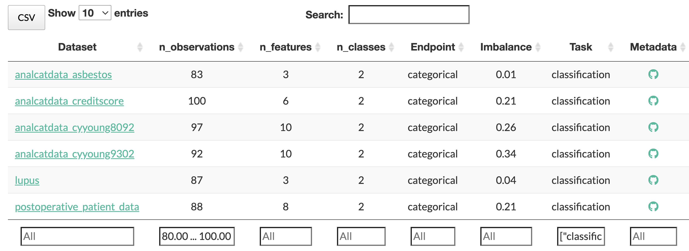

## Differentiating attributes

### New datasets with rich metadata

Since its previous major release, v0.2 [@doi:10.1186/s13040-017-0154-4], we have made substantial improvements in the collection of new datasets as well as other helpful supporting features.
PMLB now has a new repository structure that includes benchmark datasets for regression problems (Fig. {@fig:home-chart}).
To fulfill [requests made by several users](https://github.com/EpistasisLab/pmlb/issues/13), each dataset also includes a `metadata.yaml` file that contains general descriptive information about the dataset itself (an example can be viewed [here](https://github.com/EpistasisLab/pmlb/blob/master/datasets/molecular_biology_promoters/metadata.yaml)).
Specifically, for each dataset, the metadata file includes a web address to the original source of the dataset, a text description of the dataset's purpose, the publication associated with the dataset generation, the type of learning problem it was designed for (i.e., classification or regression), keywords (e.g., "simulation", "ecological", "bioinformatics"), and a description of individual features and their coding schema (e.g., ‘non-promoter’= 0,  ‘promoter’= 1).
Metadata files are supported by a standardized format that is formalized using JSON-Schema (version `draft-07`) [@doi:10.1145/2872427.2883029] &mdash; upcoming releases of PMLB will include automated validation of datasets and metadata files to further improve ease of contribution and data accuracy.

{#fig:home-chart width="100%"}

A number of open source contributors have been invaluable in providing manually-curated metadata.
In addition, contributors' careful examination have led to important bug fixes, such as a [correction to the target column](https://github.com/EpistasisLab/pmlb/issues/54) in the [bupa](https://github.com/EpistasisLab/pmlb/tree/master/datasets/bupa) dataset.

### User-friendly interfaces

On PMLB's [home page](https://epistasislab.github.io/pmlb/), users can now browse, sort, filter, and search datasets from a lookup table of datasets with summary statistics (Fig. {@fig:home-tab}).
To select datasets with numerical values for specific metadata characteristics (e.g., number of observations, number of features, class balance, etc.), one can type ranges in the box at the bottom of each numeric column in the format `low ... high`.
For example, if the user wants to view all classification datasets with 80 to 100 observations, they would select `classification` at the bottom of the `Task` column, and type `80 ... 100` at the bottom of the `n_observations` column.
The `CSV` button allows the user to download the table's contents with any active filters applied.

{#fig:home-tab width="100%"}

On the website, we have also published a concise [contribution guide](https://epistasislab.github.io/pmlb/contributing.html) with step-by-step instructions on how to add new datasets, submit edits for existing datasets, or improve the provided Python or R code.
When a new dataset is added, summary statistics (e.g., number of observations, number of classes, etc.) are automatically computed, a profiling report is generated (see below), a corresponding metadata template is added to the dataset folder, and PMLB's list of available dataset names is updated.
Other checks included in the continuous integration workflow help reduce the amount of work required from both contributors and code reviewers.

In addition to the Python interface for PMLB, we have included an [R library](https://github.com/EpistasisLab/pmlbr) that originated from a [separate repository](https://github.com/makeyourownmaker/pmlblite) that is currently unmaintained.
However, because its source code was released under the [GNU General Public License, version 2](https://www.gnu.org/licenses/old-licenses/gpl-2.0.en.html), we were able to adapt the code to make it compatible with the new repository structure in this release and offer additional functionality.
The R library also includes a number of detailed "vignette" documents to help new users learn how to use the software.

PMLB now includes original data rows with missing data (i.e., NA). 
The new version of PMLB also allows the user to select datasets most similar to one of their own using the `nearest_datasets` function. 
Here, the similarity between datasets is configurable to any number of metadata characteristics (e.g., number of samples, number of features, number of target classes, etc.).
This functionality is helpful for users who wish to find PMLB datasets with similar characteristics to their own in order to test or optimize methods (e.g., hyperparameter tuning) for their desired problem without the risk of over-fitting to their dataset. 

API reference guides that detail all user-facing functions and variables in PMLB's [Python](https://epistasislab.github.io/pmlb/python-ref.html) and [R](https://epistasislab.github.io/pmlb/r-ref.html) libraries is included on the PMLB website.

### Pandas profiling reports 

For each dataset, we use [`pandas-profiling`](https://pandas-profiling.github.io/pandas-profiling/) to generate summary statistic reports.
In addition to the descriptive statistics provided by the commonly-used `pandas.describe` (Python) [@doi:10.25080/majora-92bf1922-00a] or `skimr::skim` (R) functions, `pandas-profiling` gives a more extensive exploration of the dataset, including correlation structure within the dataset and flagging of duplicate samples.
Browsing a report allows users and contributors to easily assess dataset quality and make any necessary changes.
For example, if a feature is flagged by `pandas-profiling` as having a single value replicated in all samples, it is likely that this feature is uninformative for ML analysis and should be removed from the dataset.

The profiling reports can be accessed by clicking on the dataset name in the interactive data table or the data point in the interactive chart on the PMLB website.
Alternatively, all reports can be viewed on the repository's [gh-pages](https://github.com/EpistasisLab/pmlb/tree/gh-pages/profile) branch, or generated manually by users on their local computing resources.

### Space efficiency

We have significantly reduced the size of the PMLB source repository by using [Git Large File Storage (LFS)](https://git-lfs.github.com/) to efficiently track changes in large database source files [@doi:10.1371/journal.pcbi.1004947].
Users who would like to interact with the entire repository (including the complete database sources) locally can do so by either [installing Git LFS](https://git-lfs.github.com/) and cloning the PMLB repository, or by downloading a ZIP archive of [the repository](https://github.com/EpistasisLab/pmlb) from GitHub in a web browser.
