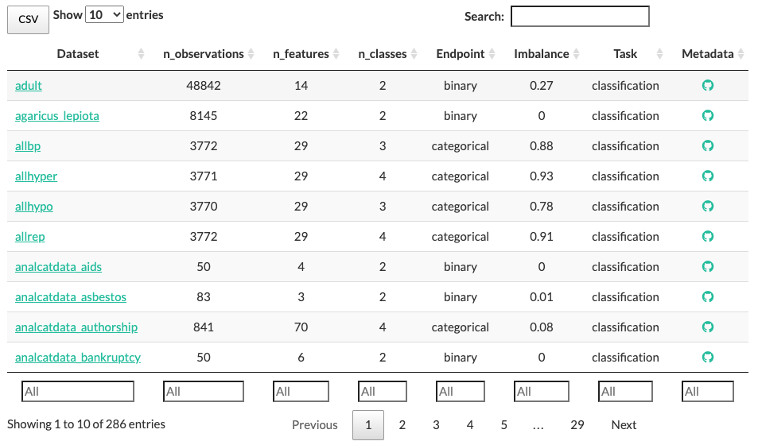

---
author-meta:
- Trang T. Le
- William La Cava
- Joseph D. Romano
- Daniel J. Goldberg
- Praneel Chakraborty
- Natasha L. Ray
- Weixuan Fu
- Jason H. Moore
bibliography:
- content/manual-references.json
date-meta: '2020-09-25'
header-includes: '<!--

  Manubot generated metadata rendered from header-includes-template.html.

  Suggest improvements at https://github.com/manubot/manubot/blob/master/manubot/process/header-includes-template.html

  -->

  <meta name="dc.format" content="text/html" />

  <meta name="dc.title" content="PMLB v1.0: an open source dataset collection for benchmarking machine learning methods" />

  <meta name="citation_title" content="PMLB v1.0: an open source dataset collection for benchmarking machine learning methods" />

  <meta property="og:title" content="PMLB v1.0: an open source dataset collection for benchmarking machine learning methods" />

  <meta property="twitter:title" content="PMLB v1.0: an open source dataset collection for benchmarking machine learning methods" />

  <meta name="dc.date" content="2020-09-25" />

  <meta name="citation_publication_date" content="2020-09-25" />

  <meta name="dc.language" content="en-US" />

  <meta name="citation_language" content="en-US" />

  <meta name="dc.relation.ispartof" content="Manubot" />

  <meta name="dc.publisher" content="Manubot" />

  <meta name="citation_journal_title" content="Manubot" />

  <meta name="citation_technical_report_institution" content="Manubot" />

  <meta name="citation_author" content="Trang T. Le" />

  <meta name="citation_author_institution" content="Department of Biostatistics, Epidemiology and Informatics, Institute for Biomedical Informatics, University of Pennsylvania, Philadelphia, PA 19104" />

  <meta name="citation_author_orcid" content="0000-0003-3737-6565" />

  <meta name="twitter:creator" content="@trang1618" />

  <meta name="citation_author" content="William La Cava" />

  <meta name="citation_author_institution" content="Department of Biostatistics, Epidemiology and Informatics, Institute for Biomedical Informatics, University of Pennsylvania, Philadelphia, PA 19104" />

  <meta name="citation_author_orcid" content="0000-0002-1332-2960" />

  <meta name="twitter:creator" content="@w_la_cava" />

  <meta name="citation_author" content="Joseph D. Romano" />

  <meta name="citation_author_institution" content="Department of Biostatistics, Epidemiology and Informatics, Institute for Biomedical Informatics, University of Pennsylvania, Philadelphia, PA 19104" />

  <meta name="citation_author_institution" content="Center of Excellence in Environmental Toxicology, University of Pennsylvania, Philadelphia, PA 19104" />

  <meta name="citation_author_orcid" content="0000-0002-7999-4399" />

  <meta name="twitter:creator" content="@jdromano2" />

  <meta name="citation_author" content="Daniel J. Goldberg" />

  <meta name="citation_author_institution" content="Department of Computer Science &amp; Engineering, Washington University in St. Louis, St. Louis, MO 63130" />

  <meta name="citation_author_orcid" content="0000-0003-4173-9867" />

  <meta name="twitter:creator" content="@None" />

  <meta name="citation_author" content="Praneel Chakraborty" />

  <meta name="citation_author_institution" content="School of Arts and Sciences, University of Pennsylvania, Philadelphia, PA 19104" />

  <meta name="citation_author_institution" content="Wharton School, University of Pennsylvania, Philadelphia, PA 19104" />

  <meta name="citation_author_orcid" content="0000-0001-9586-0721" />

  <meta name="twitter:creator" content="@None" />

  <meta name="citation_author" content="Natasha L. Ray" />

  <meta name="citation_author_institution" content="Princeton Day School, Princeton, NJ 08540" />

  <meta name="citation_author_orcid" content="0000-0001-6883-4624" />

  <meta name="twitter:creator" content="@None" />

  <meta name="citation_author" content="Weixuan Fu" />

  <meta name="citation_author_institution" content="Department of Biostatistics, Epidemiology and Informatics, Institute for Biomedical Informatics, University of Pennsylvania, Philadelphia, PA 19104" />

  <meta name="citation_author_orcid" content="0000-0002-6434-5468" />

  <meta name="twitter:creator" content="@weixuanfu" />

  <meta name="citation_author" content="Jason H. Moore" />

  <meta name="citation_author_institution" content="Institute for Biomedical Informatics, University of Pennsylvania, Philadelphia, PA 19087" />

  <meta name="citation_author_orcid" content="0000-0002-5015-1099" />

  <meta name="twitter:creator" content="@moorejh" />

  <link rel="canonical" href="https://EpistasisLab.github.io/pmlb-manuscript/" />

  <meta property="og:url" content="https://EpistasisLab.github.io/pmlb-manuscript/" />

  <meta property="twitter:url" content="https://EpistasisLab.github.io/pmlb-manuscript/" />

  <meta name="citation_fulltext_html_url" content="https://EpistasisLab.github.io/pmlb-manuscript/" />

  <meta name="citation_pdf_url" content="https://EpistasisLab.github.io/pmlb-manuscript/manuscript.pdf" />

  <link rel="alternate" type="application/pdf" href="https://EpistasisLab.github.io/pmlb-manuscript/manuscript.pdf" />

  <link rel="alternate" type="text/html" href="https://EpistasisLab.github.io/pmlb-manuscript/v/3de8f0e26704e6361c971aea6687ca4d86386c8b/" />

  <meta name="manubot_html_url_versioned" content="https://EpistasisLab.github.io/pmlb-manuscript/v/3de8f0e26704e6361c971aea6687ca4d86386c8b/" />

  <meta name="manubot_pdf_url_versioned" content="https://EpistasisLab.github.io/pmlb-manuscript/v/3de8f0e26704e6361c971aea6687ca4d86386c8b/manuscript.pdf" />

  <meta property="og:type" content="article" />

  <meta property="twitter:card" content="summary_large_image" />

  <link rel="icon" type="image/png" sizes="192x192" href="https://manubot.org/favicon-192x192.png" />

  <link rel="mask-icon" href="https://manubot.org/safari-pinned-tab.svg" color="#ad1457" />

  <meta name="theme-color" content="#ad1457" />

  <!-- end Manubot generated metadata -->'
keywords:
- machine learning
- benchmarking
- open source
lang: en-US
manubot-clear-requests-cache: false
manubot-output-bibliography: output/references.json
manubot-output-citekeys: output/citations.tsv
manubot-requests-cache-path: ci/cache/requests-cache
title: 'PMLB v1.0: an open source dataset collection for benchmarking machine learning methods'
...

<small><em>
This manuscript
([permalink](https://EpistasisLab.github.io/pmlb-manuscript/v/3de8f0e26704e6361c971aea6687ca4d86386c8b/))
was automatically generated
from [EpistasisLab/pmlb-manuscript@3de8f0e](https://github.com/EpistasisLab/pmlb-manuscript/tree/3de8f0e26704e6361c971aea6687ca4d86386c8b)
on September 25, 2020.
</em></small>

## Authors

+ **Trang T. Le** 
    {.inline_icon}
    [0000-0003-3737-6565](https://orcid.org/0000-0003-3737-6565)
    · {.inline_icon}
    [trang1618](https://github.com/trang1618)
    · {.inline_icon}
    [trang1618](https://twitter.com/trang1618) 
  <small>
     Department of Biostatistics, Epidemiology and Informatics, Institute for Biomedical Informatics, University of Pennsylvania, Philadelphia, PA 19104
  </small>

+ **William La Cava** 
    {.inline_icon}
    [0000-0002-1332-2960](https://orcid.org/0000-0002-1332-2960)
    · {.inline_icon}
    [lacava](https://github.com/lacava)
    · {.inline_icon}
    [w_la_cava](https://twitter.com/w_la_cava) 
  <small>
     Department of Biostatistics, Epidemiology and Informatics, Institute for Biomedical Informatics, University of Pennsylvania, Philadelphia, PA 19104
  </small>

+ **Joseph D. Romano** 
    {.inline_icon}
    [0000-0002-7999-4399](https://orcid.org/0000-0002-7999-4399)
    · {.inline_icon}
    [jdromano2](https://github.com/jdromano2)
    · {.inline_icon}
    [jdromano2](https://twitter.com/jdromano2) 
  <small>
     Department of Biostatistics, Epidemiology and Informatics, Institute for Biomedical Informatics, University of Pennsylvania, Philadelphia, PA 19104; Center of Excellence in Environmental Toxicology, University of Pennsylvania, Philadelphia, PA 19104
  </small>

+ **Daniel J. Goldberg** 
    {.inline_icon}
    [0000-0003-4173-9867](https://orcid.org/0000-0003-4173-9867)
    · {.inline_icon}
    [daniel0710goldberg](https://github.com/daniel0710goldberg) 
  <small>
     Department of Computer Science & Engineering, Washington University in St. Louis, St. Louis, MO 63130
  </small>

+ **Praneel Chakraborty** 
    {.inline_icon}
    [0000-0001-9586-0721](https://orcid.org/0000-0001-9586-0721)
    · {.inline_icon}
    [praneelc](https://github.com/praneelc) 
  <small>
     School of Arts and Sciences, University of Pennsylvania, Philadelphia, PA 19104; Wharton School, University of Pennsylvania, Philadelphia, PA 19104
  </small>

+ **Natasha L. Ray** 
    {.inline_icon}
    [0000-0001-6883-4624](https://orcid.org/0000-0001-6883-4624)
    · {.inline_icon}
    [natray21](https://github.com/natray21) 
  <small>
     Princeton Day School, Princeton, NJ 08540
  </small>

+ **Weixuan Fu** 
    {.inline_icon}
    [0000-0002-6434-5468](https://orcid.org/0000-0002-6434-5468)
    · {.inline_icon}
    [weixuanfu](https://github.com/weixuanfu)
    · {.inline_icon}
    [weixuanfu](https://twitter.com/weixuanfu) 
  <small>
     Department of Biostatistics, Epidemiology and Informatics, Institute for Biomedical Informatics, University of Pennsylvania, Philadelphia, PA 19104
  </small>

+ **Jason H. Moore** 
    {.inline_icon}
    [0000-0002-5015-1099](https://orcid.org/0000-0002-5015-1099)
    · {.inline_icon}
    [EpistasisLab](https://github.com/EpistasisLab)
    · {.inline_icon}
    [moorejh](https://twitter.com/moorejh) 
  <small>
     Institute for Biomedical Informatics, University of Pennsylvania, Philadelphia, PA 19087
     · Funded by National Institutes of Health Grant Nos. LM010098 and AI116794.
  </small>

## Summary

PMLB (Penn Machine Learning Benchmark) is an open source data repository containing a curated collection of datasets for evaluating and comparing machine learning (ML) algorithms.
Compiled from a broad range of existing ML benchmark collections, PMLB unifies over 150 publicly available datasets from diverse sources such as Kaggle and OpenML, enabling systematic assessment of different ML methods.
These datasets cover a range of applications, from binary/multi-class classification to regression problems with combinations of categorical and continuous features.
PMLB has both a Python interface (`pmlb`) and an R interface (`pmlbr`), both with detailed documentation that allow the user to access datasets using a simple `fetch_data` function.

## Statement of need

Benchmarking is a standard practice to illustrate the strengths and weaknesses of algorithms with regards to different problem characteristics.
In machine learning, benchmarking often involves assessing the performance of specific ML models &mdash; namely, how well they predict labels for new samples (supervised learning) or detect patterns among samples with no pre-existing labels (unsupervised learning) over a group of benchmark datasets [@doi:10.1016/j.neunet.2012.02.016; @doi:10.1145/1143844.1143865].
PMLB was designed to provide a suite of such datasets, as well as the framework for conducting automatic evaluation of the different algorithms.

The original release of PMLB (v0.2) [@doi:10.1186/s13040-017-0154-4] received overwhelmingly positive feedback from the ML community, reflecting the pressing need for a collection of standardized datasets to evaluate models.
As the repository becomes more widely used, community members have requested new features such as additional information about the datasets, as well as new functions to select datasets given specific criteria.
In this paper, we review existing functionality and present new enhancements that help facilitate frictionless interaction with the repository, both from the perspective of database contributers and end-users.

## Differentiating attributes

### New datasets with rich metadata

Since its previous major release (0.2) [@doi:10.1186/s13040-017-0154-4], we have made substantial improvements in the collection of new datasets as well as other helpful supporting features.
Furthermore we have redesigned the repository structure, and PMLB now includes benchmark datasets for regression problems (Fig. {@fig:home-chart}).
To fulfill [requests made by several users](https://github.com/EpistasisLab/penn-ml-benchmarks/issues/13), each dataset also includes a `metadata.yaml` file that contains general descriptive information about the dataset itself (an example can be viewed [here](https://github.com/EpistasisLab/penn-ml-benchmarks/blob/master/datasets/molecular_biology_promoters/metadata.yaml)).
Specifically, for each dataset, the metadata file includes a web address to the original source of the dataset, a text description of the dataset's purpose, the publication associated with the dataset generation, the type of learning problem it was designed for (i.e., classification or regression), keywords (e.g., "simulation", "ecological", "bioinformatics"), and a description of individual features and their coding schema (e.g., ‘non-promoter’= 0,  ‘promoter’= 1).

{#fig:home-chart width="100%"}

We are grateful for PMLB's open source contributors, who have gradually increased the number of datasets with metadata.
By carefully examining the data source and gathering important information about the dataset, contributors have flagged serious issues with some datasets such as the [incorrect column](https://github.com/EpistasisLab/penn-ml-benchmarks/issues/54) assigned as 'target' in the [bupa](https://github.com/EpistasisLab/penn-ml-benchmarks/tree/master/datasets/bupa) dataset.

### User-friendly interfaces

On [PMLB's home page](https://epistasislab.github.io/penn-ml-benchmarks/), users can now browse, sort, filter, and search from a lookup table of datasets with summary statistics (Fig. {@fig:home-tab}).
To select datasets with numerical values for specific metaparameters (e.g., number of observations, number of features, class balance, etc.), users can type ranges in the box at the bottom of each numeric column in the format `low ... high`.
For example, if the user wants to view all classification datasets with 80 to 100 observations, they would select `classification` at the bottom of the `Task` column, and type `80 ... 100` at the bottom of the `n_observations` column.
The `CSV` button allows the user to download the table's contents with any active filters applied.

{#fig:home-tab width="100%"}

On the website, we have also published a detailed but concise contribution guide with step-by-step instructions on how to add new datasets, submit edits for existing datasets, or improve the provided Python or R code.
When a new dataset is added, summary statistics (e.g., number of observations, number of classes, etc.) are automatically computed, a profiling report is generated (see below), a corresponding metadata template is added to the dataset folder, and PMLB's list of available dataset names is updated.
Other checks included in the continuous integration workflow help to reduce the amount of work required from both contributers and code reviewers.

In addition to the Python interface for PMLB, we have included an [R library](https://github.com/EpistasisLab/pmlbr), both of which can be installed with a single command &mdash; `pip install pmlb` or `install.packages('pmlbr')`, respectively.
The R library has been adapted from a [separate repository](https://github.com/makeyourownmaker/pmlblite) that is currently unmaintained, but released under the [GPL-2 license](https://www.gnu.org/licenses/old-licenses/gpl-2.0.en.html).
However, because the original source code was released under the [GNU General Public License, version 2](https://www.gnu.org/licenses/old-licenses/gpl-2.0.en.html).
The R library also includes a number of detailed "vignette" documents to help new users learn how to use the software.

PMLB now includes original data rows with missing data (i.e., NA). 
The core function of PMLB, fetch_data(), retains previous behavior (`dropna=True`) by default, which excludes all rows with missing data. 
However, if the user chooses to treat the missing values differently, they can use fetch_data() with the option `dropna=False` to obtain the original dataset and apply their own removal or imputation method.
Defining the neighborhood to be the datasets' metadata/characteristics space, we also enabled the option to select the nearest PMLB datasets given a data frame.
This functionality would be helpful for users who would like to find PMLB datasets with similar characteristics to their own to make inference on their dataset, e.g., where to start the hyperparameter search.

An [API reference guide](https://epistasislab.github.io/penn-ml-benchmarks/reference.html) that details all user-facing functions and variables in PMLB's Python and R libraries is included on the PMLB website.

#### Pandas profiling reports 

For each dataset, we use [`pandas-profiling`](https://pandas-profiling.github.io/pandas-profiling/) to generate summary statistic reports.
In addition to the descriptive statistics provided by the commonly-used `pandas.describe` (Python) or `skimr::skim` (R) functions, `pandas-profiling` gives a more extensive exploration of the dataset, including correlation structure within the dataset and flagging of duplicate samples.
Browsing a report allows users and contributors to easily assess dataset quality and make any necessary changes.
For example, if a feature is flagged by `pandas-profiling` as having a single value replicated in all samples, it is likely that this feature is uninformative for ML analysis and should be removed from the dataset.

The profiling reports can be accessed by clicking on the dataset name in the interactive data table or the data point in the interactive chart on the PMLB website.
Alternatively, all reports can be viewed on the repository's [gh-pages](https://github.com/EpistasisLab/penn-ml-benchmarks/tree/gh-pages/profile) branch, or generated manually by users on their local computing resources.

### Efficiency

We have significantly reduced the size of the PMLB source repository by using [Git Large File Storage (LFS)](https://git-lfs.github.com/) to efficiently track changes in large database source files.
Users who would like to interact with the entire repository (including the complete database sources) locally can do so by either [installing Git LFS](https://git-lfs.github.com/) and cloning the PMLB repository, or by downloading a ZIP archive of [the repository](https://github.com/EpistasisLab/penn-ml-benchmarks) from GitHub in a web browser.

## References {.page_break_before}

<!-- Explicitly insert bibliography here -->

